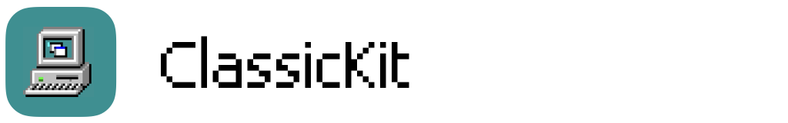
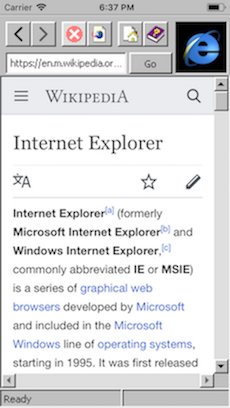
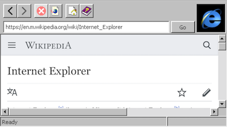
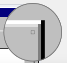
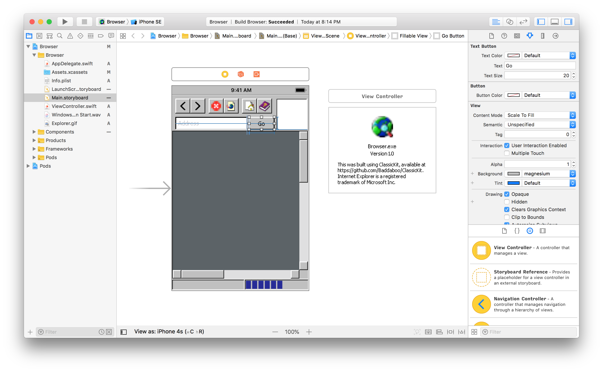

# 
A collection of classic-style UI components for UIKit, influenced by Windows 95

      

## Introduction
This is a little exploration into applying '90s-era design & principles into a modern platform with some primitive components. The assets and design metrics were (for the most part) taken from an actual installation of Windows 95. These are pixel-accurate renditions of the original design:

**Update:**
- (3/17) Added a simple Blue Screen of Death! Simply shake the device vigorously.

## Usage
- The `Browser` example can be run out-of-the-box.
- You _should_ be able to include some or all of the files under `/Components` in your project.
- Each component is intended to be used like their UIKit counterparts. For example, `CKButton` should respond to gesture events just as `UIButton` would.
- These are `@IBDesignable` components! That means you can lay out your entire app with these components in Interface Builder and Xcode will render them for you:

## Notes & FAQ
- This project is very much a work-in-progress. Although it was designed with modularity and robustness in mind, there are no guarantees on reliability.
- **Q: Why did you do this?**
  - This project was born out of some wholesome sarcasm and Millennial jokes with [Ben Galassi.](http://bengalassi.com) Check out his work!
- **Q: If this project is made for Apple devices, why based it on Microsoft's design?**
  - Most people were using Windows during this age and far more people recognize the Windows Standard design pattern than Platinum. If you need any proof, [PCs sold close to 100 million units in 1998, compared to just 2.7 million for Macintosh.](https://arstechnica.com/features/2005/12/total-share/8/)
  - I may revisit this point in the future.
- **Q: Why isn't the UI rendering in my Storyboard?**
  - Interface Builder is very finicky. Rendering typically fails because the underlying code has an error or a constraint cannot be satisfied. Even if you fix these issues, you may have to clear the cache and restart Xcode.
- **Q: Why do I need YYImage?**
  - You don't. `YYImage` is used in `CKImageView` to animate the throbber animation in the `Browser` example, but you can remove the reference in `CKImageView.swift`. Eventually this dependency will be removed.
- Please let me know if you have any questions or comments! I'd also love to chat about design or tech nostalgia 🙂

## Disclaimer
I do not claim ownership of the assets or logos used in this project. Windows and Internet Explorer are registered trademarks of Microsoft Inc.

## License
MIT
